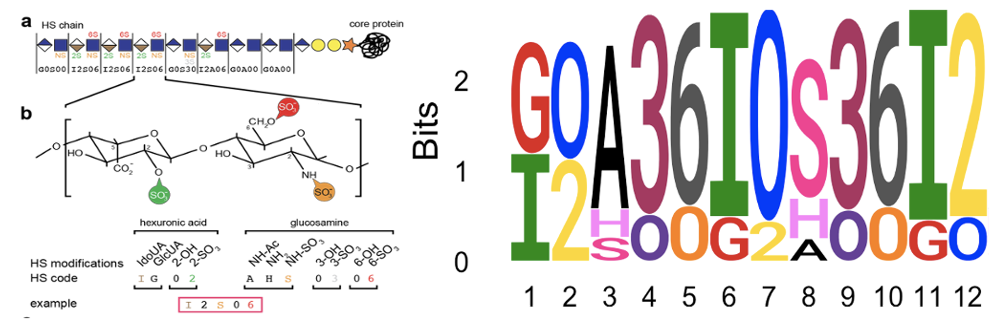

1. Introduction:
----------------

Motif discovery from a given set of linear sequences is a common
computational problem. Many motif discovery tools and software are
available for finding motifs in DNA, RNA and protein sequences. These
software find motifs significantly enriched in the sequences composed of
single alphabet letters. However, motifs in some other biological
contents may not be consisted of single letters, for example, chemical
modifications on DNA or proteins. Here, we describe our
“HSMotifDiscover” tool that utilizes Gibbs Sampling algorithm to find
motifs in Heparan Sulfate (HS) sequences. HS sequences are linear
glycans of repeating disaccharides composed of hexuronic acids and
N-acetyle-glucosamines and added to membrane or extracellular proteins
to form specific proteoglycans. Further sulfate modifications on the
hexuronic acids and glucosamines generate HS motifs that are responsible
for the functions of HS sequences. Therefore, HS sequences are different
from the nucleic or protein sequences in at least three ways:

-   Each position is composed of a saccharide that can be modified in
    either one or two ways, resulting in a two- (“dimer”) or
    three-letter (“trimer”) representation for the types of saccharide
    and the chemical modifications.
-   The dimer and trimer are present alternatively as disaccharides in
    the HS sequences.
-   The motifs may be consisted of either same HS residues/types or same
    chemical modifications on different HS residues.

HSMotifDiscover tool considers these unique properties in searching for
enriched motifs in HS sequences. It first maps the saccharides to
“Lawrence codes” and then to alphabet letter. Motif search occurs in the
linear alphabet space and the resultant motifs are converted back to the
Lawrence codes for a logo visualization. In addition, we also consider
the scenario that the input HS sequences may come with scores or
weights. Similar to how DNA microarrays have been used to define DNA
motifs bound to transcription factors experimentally, array technology
has also been developed to help define HS motifs recognized by specific
proteins, including antibodies. The array assays yield an affinity score
for each of the short HS sequences that are synthesized and printed on
the array. The affinity profiles are then used to define HS motifs.
Thus, when available, HSMotifDiscover tool will use the binding affinity
scores to weight the HS sequences to find the enriched motifs for a
given antibody or protein, using either the full spectrum of affinity
scores or a predefined threshold to binarizing the input sequences to
protein-bound and unbound (background) sequences.

However, the HSMotifDiscover algorithm is not limited to HS sequences
only. It can be used for other glycan sequences. Moreover, we have
implemented it in a way that the tool can actually be used to discover
motifs in any kind of linear sequences, from simple cases like DNA, RNA,
protein sequences to more specific cases where the sequences can be
composed of either non-standard alphabet or words that represent dimers,
trimers or any combination of letters. Furthermore, to facilitate its
usage, we have also developed this interactive R Shiny app "HSMotifDiscover_ShinyApp" which is can be dowloaded from current webpage to run on a local computer. 

- Experimental biologists can also use our app directly at
<a href="https://hsmotifdiscover.shinyapps.io/HSMotifDiscover_ShinyApp/" class="uri">https://hsmotifdiscover.shinyapps.io/HSMotifDiscover_ShinyApp/</a>
 to discover any type of motifs.
 
- Coding enthusiasts can use an r-package of the app named as `HSMotifDiscover` available at <a href="https://github.com/bioinfoDZ/HSMotifDiscover" class="uri">https://github.com/bioinfoDZ/HSMotifDiscover</a>

2. Concept:
-----------

The HS sequences are diffrent from DNA, RNA and protein sequences in a
few ways. So, the Gibbs-Sampling algorithm has been implemented in such
a way, it can discover motifs in the heparan sulfate (HS) sequences.

